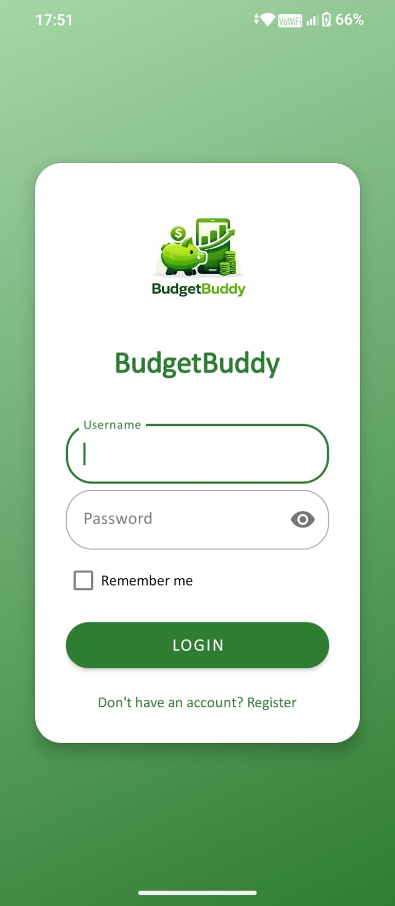
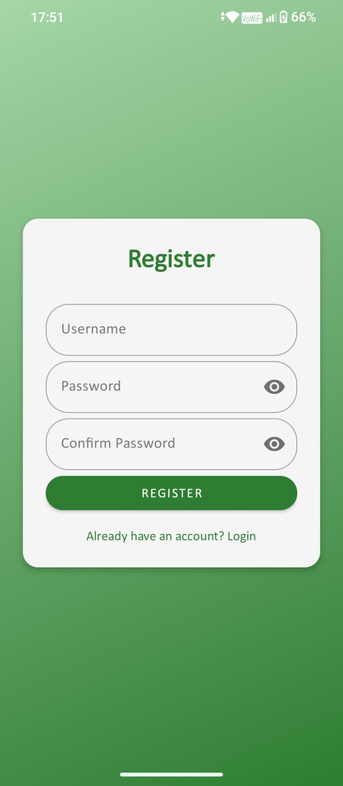
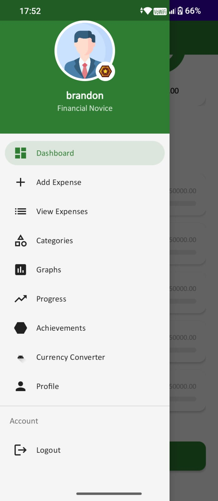
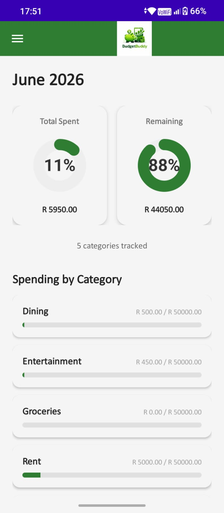
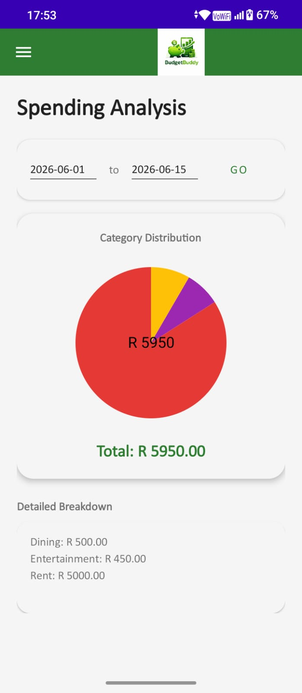
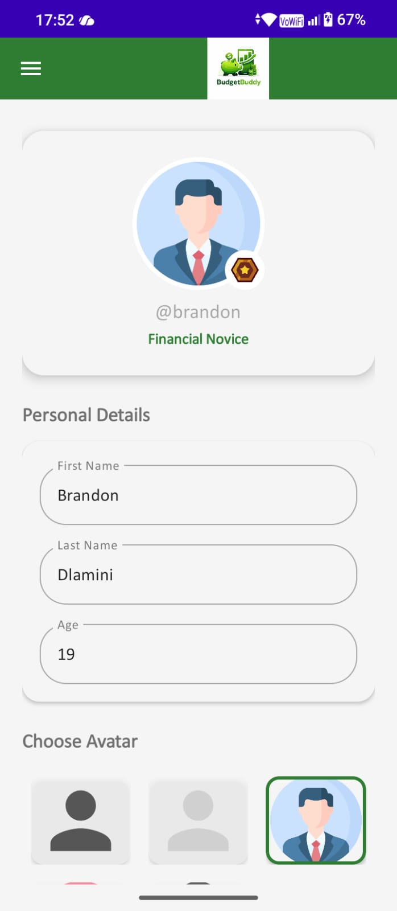
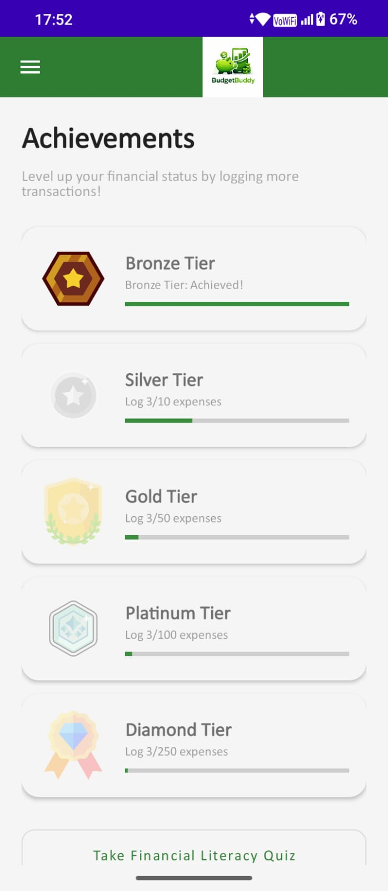

# 📂 Budget Buddy - POE Part 3 Final Documentation
 
**Institution:** IIE Rosebank College Braamfontein (Diploma in IT Software Development)  
**Platform:** Android (Kotlin)  
**Database:** Room SQLite (MVVM Architecture)  
**Design System:** Material Design 3  

---

## 🚀 1. Application Overview

**What it does:** Budget Buddy is a premium, offline-first personal finance application that empowers users to take complete control of their financial health. It provides robust daily transaction tracking, category-based spending analysis, and highly visual progress dashboards (such as depleting/filling gauges) to give users immediate, intuitive feedback on their financial status.

**Who it's for:** This app is designed primarily for university students and young professionals who need a straightforward, visually engaging tool to build financial discipline without the overwhelming complexity of enterprise accounting software.

---

## 🎥 2. Video Demonstration

Watch the full walkthrough of the application, including the transition from prototype to the final polished build, showcasing all features and technical implementations:

👉 **[Budget Buddy - Full App Walkthrough](https://youtu.be/W6mVr5_olYU)** *(Placeholder Link)*

---

## 🖼️ 3. Screenshots

### Authentication & Navigation
| Login | Sign Up | Menu |
| --- | --- | --- |
|  |  |  |
| *Secure Access* | *User Registration* | *Synchronized Side Navigation* |

### Core Analytics
| Dashboard | Spending Analysis |
| --- | --- |
|  |  |
| *Dynamic Gauges & Alerts* | *Interactive Charts & Goal Tracking* |

### User Personalization & Gamification
| Profile | Achievements |
| --- | --- |
|  |  |
| *Avatar & Detail Customization* | *Gamified Badges & Knowledge Rank* |

---

## 🎨 4. Design Decisions

The UI/UX strategy for Budget Buddy was heavily focused on reducing cognitive load and modernizing the experience:

* **Material Design 3:** Adopted MD3 standards for a consistent, premium feel. This includes card-based UI elements, outlined text fields, and dynamic elevation.
* **Visual Over Text:** Replaced static, text-heavy data summaries with custom Canvas-built gauges and interactive Pie Charts. Users can understand their financial health at a glance (e.g., immediate Green/Red alerts when limits are approached).
* **Centralized Navigation:** Implemented a professional Hamburger Navigation Drawer to declutter the main screens and provide a scalable hub for new features.
* **Unified Branding:** Replaced default Android assets with a custom branded Launcher Icon and synchronized the app bar styling to build a cohesive identity.

---

## ✨ 5. Core Custom Features

Beyond standard CRUD operations, Budget Buddy implements two advanced custom features to elevate the user experience:

### 📄 1. PDF Transcript Generator
Instead of standard text-based exports, the app utilizes an advanced visual reporting engine. It generates a professional, paginated PDF document of the user's transaction history. Crucially, this feature **embeds actual captured receipt images** alongside the transaction data. This provides a highly reliable, verifiable expense transcript that is perfect for auditing, sharing with accountants, or maintaining personal records.

### 💱 2. Currency Converter
To accommodate international students, travelers, or users dealing with multiple currencies, the app includes a dynamic Currency Converter. This tool allows users to seamlessly calculate and adjust their budget goals or specific transaction entries across different currencies, ensuring precise financial tracking regardless of geographic location.

---

## 🐙 6. GitHub & GitHub Actions Implementation

Robust version control and CI/CD practices were utilized to maintain code stability throughout the POE development cycle:

* **Source Control:** GitHub was used to track all iterations of the project. A branching strategy was employed (e.g., separating UI overhauls, database migrations, and feature additions into their own branches) before merging into the main branch to prevent code conflicts.
* **GitHub Actions (CI/CD):** Automated workflows were configured to trigger on every push and pull request to the main branch. This pipeline automatically checks the Kotlin code for syntax errors, runs basic linting, and builds the Android APK. This ensured that no broken code was ever merged and that the application was always in a deployable state.

---

## 🔄 7. Feature Evolution: Prototype (Part 2) vs. Final App (Part 3)

The following table explicitly compares the features of the initial prototype to the enhanced, production-ready application.

| Feature Area | Initial State (Part 2) | Final Developed App (Part 3) |
| --- | --- | --- |
| **User Interface** | Basic XML layouts with default styling. | **Full Material 3 Overhaul**: Consistent card-based UI, outlined components, custom typography. |
| **Navigation** | Standard button-driven flow. | **Synchronized Side Menu**: Professional Hamburger Navigation Drawer. |
| **Dashboard** | Static text summary. | **Visual Analytics**: Custom Canvas-built "Spent" and "Remaining" gauges with Red/Green alerts. |
| **Spending Analysis** | Static text list of category totals. | **Visual Analytics Engine**: Interactive Pie Chart breakdown vs. Monthly Goal boundaries. |
| **Data Logging** | Basic fields for amount and date entry. | **Precision Tracking**: Integrated Date & Time pickers with background state restoration. |
| **Receipt System** | Basic image capture (prone to crashes). | **Stable Media Handling**: Secure `FileProvider` with memory-optimized image downsampling. |
| **Reporting** | Simple text-based transaction list. | **Visual PDF Export**: Embeds actual receipt images for every transaction with automated pagination. |
| **Gamification** | Non-existent. | **Achievement Engine**: 5-Tier Badge system (Bronze to Diamond) + Knowledge Rank. |
| **Profile** | Static view with only the username. | **Full Customization**: User can edit personal details and choose from 5 unique avatars. |
| **Security** | Permanent login with no way to exit. | **Session Management**: Dedicated Logout functionality with task-stack clearing. |

---

## 🎯 8. Rubric Fulfillment (Technical Details)

| Rubric Criterion | Implementation Status | Technical Implementation Details |
| :--- | :--- | :--- |
| **1. Real Phone Support** | ✅ Complete | Optimized for physical hardware with secure camera intents and high-res image management. |
| **2. Flawless Data Capture** | ✅ Complete | Implemented ViewBinding and strict input validation for amounts, dates, and times. |
| **3. Original Features** | ✅ Complete | **Feature 1:** PDF Export with embedded receipts. **Feature 2:** Dynamic Currency Converter. |
| **4. Graphs (Spending)** | ✅ Complete | Custom `PieChartView` in Reports showing distribution vs. Monthly Goal boundaries. |
| **5. Progress Dashboard** | ✅ Complete | Dual-gauge visualizers with real-time status text alerts (e.g., "Money is finished"). |
| **6. Gamification** | ✅ Complete | 5-Tier Achievement system based on app usage and profile progression. |
| **7. Excellent UI** | ✅ Complete | Unified Material 3 design, custom typography, and synchronized navigation menus. |
| **8. Professional Demo** | ✅ Complete | Walkthrough video demonstrating the transition from Prototype to Final App. |

---

## 🛠 9. Key Technical Robustness Fixes

* **Memory Management:** Implemented `inSampleSize` logic in the `BitmapFactory` to handle high-resolution camera photos without `OutOfMemory` crashes.
* **State Persistence:** Utilized `onSaveInstanceState` across fragments to ensure selections (times, dates, photo paths) survive configuration changes and process death.
* **Database Reliability:** Resolved recursive Room initialization crashes by using safe raw SQL seeding in the `onOpen` callback.
* **ViewBinding:** Enforced type-safe view access across 100% of fragments to eliminate `NullPointerExceptions`.
* **Data Integrity:** Migrated persistent data management from SharedPreferences to RoomDB (User entity) to ensure achievement data is specific to each account.

---
**Developed for Rosebank College POE - Part 3**
